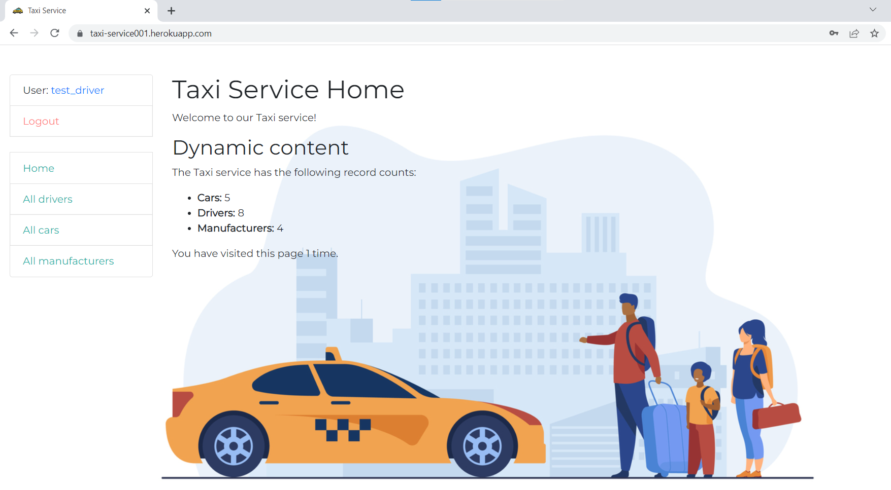
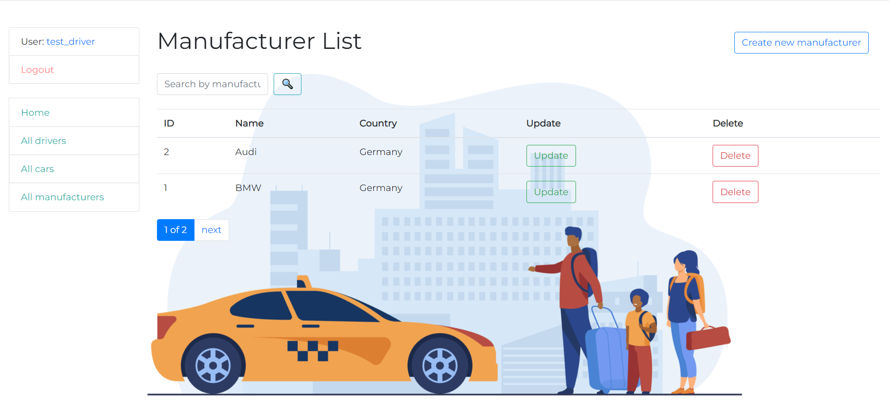

# Taxi service project

Django project for managing taxi drivers and cars in Taxi Service

## Check it out!

[Taxi service project on heroku](https://taxi-service001.herokuapp.com/)

## Installation

Python 3 must be already installed

```shell
git clone https://github.com/mens0/taxi-service-project.git
cd taxi-service-project
python -m venv venv
venv/scripts/activate
pip install -r requirements.txt
python manage.py runserver  # start Django project
```

## Features

* Authentication functionality for Driver/User
* Managing cars, drivers, manufacturers directly from website
* Admin panel for advanced managing

## Demo

